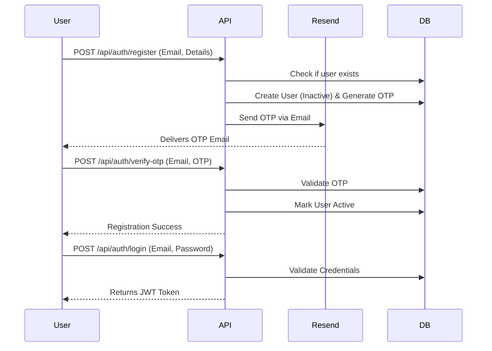
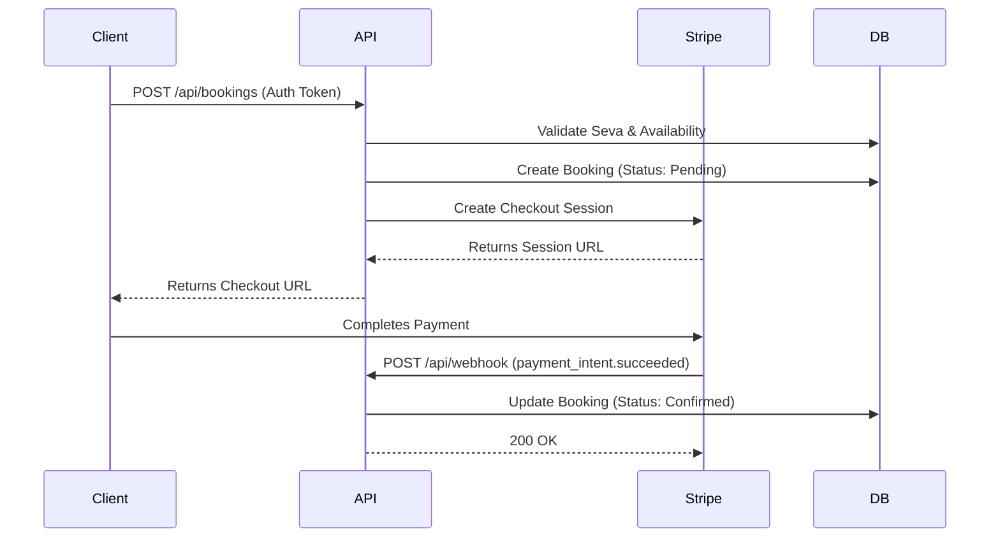
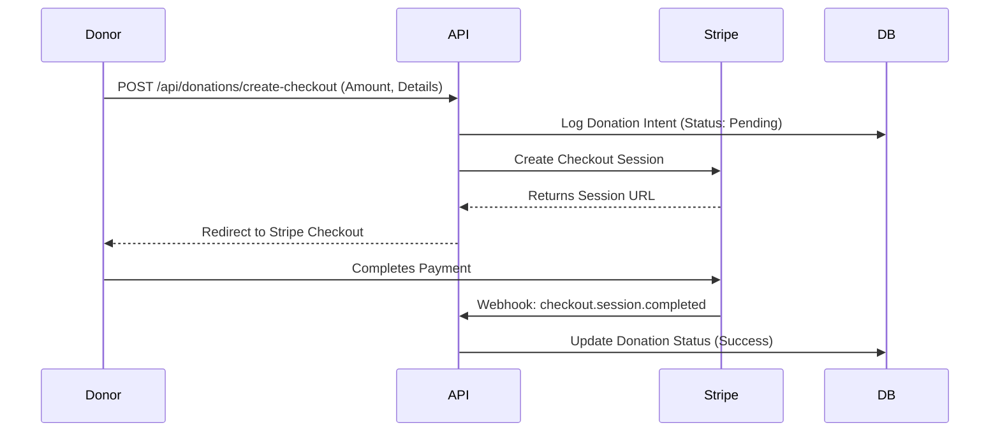
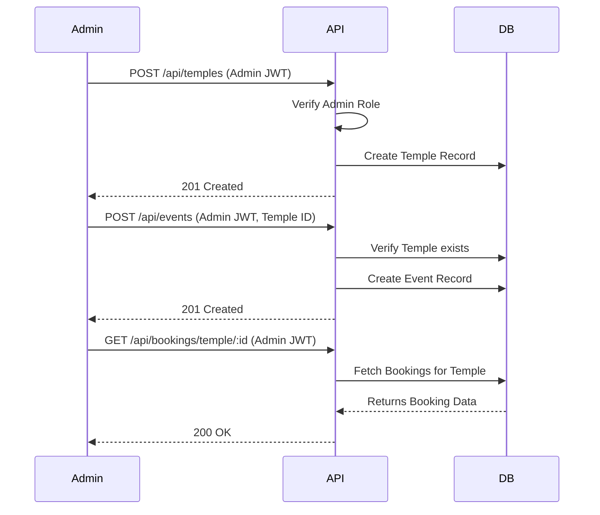

# OTIS API Backend

[](LICENSE)
[](https://nodejs.org/)

**OTIS (Online Temple Information System)** is a comprehensive Express.js and MongoDB RESTful API backend designed for Temple Management. It provides robust endpoints for handling user authentication, temple events, sevas, accommodations, donations, and secure payment processing.

## 🏗 Architecture & Data Flow

```mermaid
graph TD
    Client([Client Application]) -->|HTTP REST| APIGateway(server.js)
    
    subgraph Middleware
        Auth[JWT Auth Middleware]
        CORS[CORS & JSON Parser]
    end
    
    APIGateway --> CORS
    CORS --> Routes
    
    subgraph Routes
        R_Auth[/api/auth]
        R_Bookings[/api/bookings]
        R_Payments[/api/payments & /api/webhook]
        R_Core[/api/temples, /api/sevas, /api/events]
    end
    
    Routes --> R_Auth & R_Bookings & R_Payments & R_Core
    R_Bookings -.-> Auth
    
    subgraph Controllers & Services
        Ctrl[Controllers]
        Serv[Services]
    end
    
    R_Auth & R_Bookings & R_Core --> Ctrl
    R_Payments --> Serv
    
    subgraph Models
        M_User[User / OTP]
        M_Temple[Temple / Event / Seva]
        M_Tx[Booking / Donation]
    end
    
    Ctrl --> M_User & M_Temple & M_Tx
    Serv --> M_Tx
    
    DB[(MongoDB)]
    M_User & M_Temple & M_Tx <--> DB
    
    subgraph External Services
        Stripe[Stripe Payment Gateway]
        Resend[Resend / Email]
    end
    
    Serv <--> Stripe
    Ctrl -.->|Send OTPs/Receipts| Resend
    
    subgraph Background Jobs
        AutoConfirm[Auto-Confirm Bookings]
        KeepAlive[Keep-Alive Server]
    end
    
    AutoConfirm -.-> DB
```

## 🔄 Detailed Workflows

### 1. User Authentication Flow


### 2. Seva Booking & Payment Flow


### 3. Donation Flow


### 4. Background Jobs Flow
```mermaid
graph TD
    Cron([Cron Job / setInterval]) -->|Triggers| AutoConfirm[Auto Confirm Bookings]
    
    AutoConfirm --> Query[Find Pending Bookings > 15 mins]
    Query --> DB[(MongoDB)]
    DB -->> AutoConfirm: Returns Expired Bookings
    
    AutoConfirm --> Loop[For each Booking]
    Loop --> Update[Mark Status as 'Cancelled']
    Update --> DB
    
    Cron2([Ping Interval]) -->|Triggers| KeepAlive[Server Ping]
    KeepAlive -->|GET /ping| Server[API Server]
    Server -->> KeepAlive: 200 OK
```

### 5. Admin Temple Management Flow


## 🌟 Key Features

- **Authentication & Authorization**: Secure JWT-based authentication with OTP verification via email (Resend/Nodemailer) and bcrypt password hashing.
- **Temple & Event Management**: CRUD operations to manage temple details, schedules, and special events.
- **Booking Systems**: Dedicated modules to handle bookings for Sevas and Accommodations, including automated confirmation background jobs.
- **Donation Module**: Endpoints for tracing, managing, and receipting temple donations.
- **Payment Integration**: Streamlined checkout and payment processing handled via Stripe.

## 🚀 Getting Started

Follow these instructions to get a copy of the project up and running on your local machine for development and testing purposes.

### Prerequisites

- [Node.js](https://nodejs.org/) (v14 or higher recommended)
- [MongoDB](https://www.mongodb.com/) (Local instance or Atlas URI)
- [Stripe Account](https://stripe.com/) (For payment processing)
- [Resend Account](https://resend.com/) (For OTP/transaction emails)

### Installation

1. **Clone the repository**
   ```bash
   git clone https://github.com/satyakiran29/OTIS_API.git
   cd OTIS_API
   ```

2. **Install dependencies**
   ```bash
   npm install
   ```

3. **Configure Environment Variables**
   Create a `.env` file in the root directory based on the `.env.exmple` file and configure the necessary credentials:
   ```env
   PORT=5000
   MONGO_URI=mongodb://127.0.0.1:27017/temple_auth
   JWT_SECRET=your_jwt_secret_key
   STRIPE_SECRET_KEY=your_stripe_secret_key
   RESEND_API_KEY=your_resend_api_key
   RESEND_FROM_EMAIL=onboarding@psatyakiran.in
   ```

4. **Start the Development Server**
   ```bash
   npm run dev
   ```
   The API will be running on `http://localhost:5000`.

### Usage Example

**Authenticate User via cURL**
```bash
curl -X POST http://localhost:5000/api/auth/login \
  -H "Content-Type: application/json" \
  -d '{"email":"user@example.com", "password":"password123"}'
```

## 🤝 Contributing

Contributions are what make the open-source community such an amazing place to learn, inspire, and create. Any contributions you make are **greatly appreciated**.

Please read our [Contributing Guidelines](CONTRIBUTING.md) for details on our code of conduct, and the process for submitting pull requests to us.

## 💬 Support & Help

If you have any questions, run into issues, or want to suggest improvements:
- Please check existing [Issues](https://github.com/satyakiran29/OTIS_API/issues) or create a new one.

## 📜 License

This project is licensed under the ISC License. For more information, please see the [LICENSE](LICENSE) file.

## ✨ Maintainers

- **Satya Kiran** - *Initial work* - [satyakiran29](https://github.com/satyakiran29)
